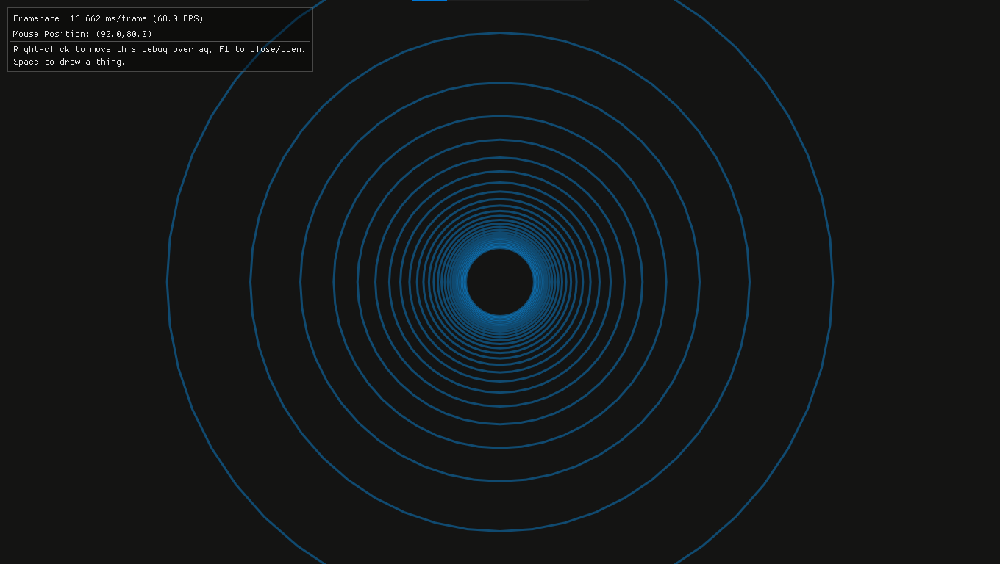

Draw a grid using the [IMGUI](https://github.com/ocornut/imgui)
drawing API (as opposed to calling directly to OpenGL).

## Contents

- If you cloned this repo just to use the Windows `.exe`:
    - [grid user manual](README.md#grid-user-manual)
- If you cloned this repo to modify the source code:
    - [Build this project](README.md#build-this-project)
- If you want to do something like this from scratch:
    - [How I set this project up](README.md#how-i-set-this-project-up)
    - [Skip to the coding part of project setup](README.md#start-coding)

# grid user manual

TODO: Write this section when there's a grid application that
does good grid stuff.

Right now, the `.exe` does this:

- goes fullscreen
- draws a bunch of blue circles that interact with the mouse



- `F1`
    - toggle debug overlay on/off
- `Space`
    - toggle circles on/off
- `Esc`
    - quit the application

# Build this project

This should build and run on any OS and hardware that supports
OpenGL3, but I am writing this README assuming:

- you are on Windows
- you do not have a setup to build native Windows executables
- you do not want to install Visual Studio

Here are my instructions to [set up
MSYS2](https://github.com/sustainablelab/msys). Installation is
pretty quick, just downloading the setup files from
[MSYS2](https://www.msys2.org/) and running a few package manager
commands to get the base system setup. Now you have a bash
terminal for the MSYS2 `mingw64` subsystem. My instructions also
detail how to set up PowerShell shortcuts to launch the `mingw64`
bash, and a quick test to see `gcc` compiling.

Following my instructions to [set up
MSYS2](https://github.com/sustainablelab/msys) you will install
these packages:

```bash
pacman -S make
pacman -S gcc
pacman -S pkgconf
pacman -S git
```

- `make` is the build tool
- `gcc` is the compiler
- the Makefile uses `pkg-config` to figure out what `LIBS` to add
  to the `CFLAGS` variable.
- `git` is the command-line git client

These are not required for building my project, but I also
install these packages:

```bash
pacman -S man
pacman -S vim
pacman -S python
```

Launch `mingw64` and enter the following commands at the bash
terminal.

The following commands show how to use `git` to get the source
and build the `.exe`:

1. Clone the repository:

```git
git clone https://sustainablelab/im-grid.git
```

2. Enter the folder:

```bash
cd im-grid
```

3. Get IMGUI:

```git
git submodule update --init
```

If you are not familiar with Git submodules, [here is what that
command is all about](README.md#git-submodules).

Try building the application:

```bash
make
```

Expect the build to fail if this is the first time building an
IMGUI application on this computer. I explain why
[here](README.md#imgui-backend-dependencies). The short answer is
that there are backend dependencies. Install the backend
dependencies using the environment's package manager.

The MSYS2 package manager is `pacman`.

I am on Windows using the `mingw64` subsystem of MSYS2.
I have every backend thing I need except for `SDL2`.

4. Install the SDL2 package:

```bash
pacman -S mingw-w64-x86_64-SDL2
```

For comparison, on Linux it's installed this way (copied from the
Makefile, I haven't verified this):

```bash
apt-get install libsdl2-dev
```

5. Now build the application for real:

```bash
make
```

6. And run the application:

```bash
./grid.exe
```

# How I set this project up

This documentation is for starting from scratch.

## Make a repo and set up the remote

Make a folder named `im-grid`

```bash
cd gitrepos
mkdir im-grid
```

Create a `README.md`

```bash
cd im-grid
vim README.md
```

Initialize as a git repo and commit this file as the initial
commit:

```git-bash
git init
git add .
git commit -m 'Initial commit'
```

Set up a remote on GitHub (do that on the GitHub website). Then
tell this repo to use the remote for pushing master and push
master:

```
git remote add origin https://github.com/sustainablelab/im-grid.git
git push -u origin master
```

## Add IMGUI

Add IMGUI as a submodule:

```git-bash
git submodule add https://github.com/ocornut/imgui.git
git commit -m 'Add IMGUI as Git submodule'
```

## Create a Makefile

I use SDL2 for windowing and OpenGL3 for graphics. IMGUI has an
example folder for each possible windowing and graphics combo.
Copy the Makefile from the SDL2-OpenGL3 example here:

```IMGUI-Makefile-path
imgui/examples/example_sdl_opengl3/Makefile
```

First I run make in this example folder to make sure I have all
the dependencies installed to run this example. The build creates
a `.exe`. I run the `.exe` and the demo IMGUI window opens up.
Yay.

Paste the Makefile into a new Makefile at the project top level
(the folder that has this REAMDE.md in it).

Edit this Makefile. Change the `EXE` name and `IMGUI_DIR`
directory:

```make
EXE = grid
IMGUI_DIR = ./imgui
```

That's all you have to change. Then I add a few recipes to the
Makefile to make it easier to navigate the codebase.

### A really brief make primer

*Read this bit if you want to understand how the Makefile works.*

- The `make` language has variables. `$(BOB)` is a Makefile
  variable named BOB that is defined somewhere in the Makefile
  like this `BOB = whatever-bob-is`
- `$(CXXFLAGS)` are the CFLAGS (compiler flags). These are OS
  dependent. I don't have anything insightful to say about them.
- `$(CXX)` is g++ (the gcc C++ compiler) or clang++ (the clang
  C++ compiler) depending on what compiler is on your system.

`CXX` isn't defined in the Makefile like `CXXFLAGS` is. Run
command `make what-compiler` to inspect `$(CXX)`. This is a handy
trick for any `make` variable you want to inspect. Here is the
recipe:

```make
.PHONY: what-compiler
what-compiler:
	@echo $(CXX)
```

These are the build recipes (the stuff that happens when you run
the command `make`):

```make
%.o:%.cpp
	$(CXX) $(CXXFLAGS) -c -o $@ $<

%.o:$(IMGUI_DIR)/%.cpp
	$(CXX) $(CXXFLAGS) -c -o $@ $<

%.o:$(IMGUI_DIR)/backends/%.cpp
	$(CXX) $(CXXFLAGS) -c -o $@ $<

all: $(EXE)
	@echo Build complete for $(ECHO_MESSAGE)

$(EXE): $(OBJS)
	$(CXX) -o $@ $^ $(CXXFLAGS) $(LIBS)

clean:
	rm -f $(EXE) $(OBJS)
	rm -f libs.txt
```

Make has a terse language for describing the build. The terseness
is from **pattern matching** and **automatic variables**.

First, know that you can run `make -n` to see what these recipes
look like when `make` expands them. The `-n` flag tells `make` to
print the recipe without actually doing anything. It's a handy
way to preview what the command `make` will do without actually
running it.

```bash
make -n
```

Now that you know what the expanded recipes look like, the rest
of this will make sense.

`%` is a pattern matching rule. `%.o` means any object file that
needs to get built will use the `%.o` recipe. The `%` now holds
the file stem, so `%.o: %.c` means that `bob.c` is a
pre-requisite to build target `bob.o`.

**pre-requisite** means that if `bob.c` has not been touched,
`bob.o` does not need to be rebuilt. But if `bob.c` has been
touched, `make` will rebuild `bob.o`.

The `$@` is the name of the target, `bob.o`. The `$<` is the
prerequisite(s). The order of `$@` and `$<` don't matter -- the
compiler figures out which is the output file (the target) and
which are the input files.

## Add make recipes for ctags

This recipe generates a ctags file called `tags`:

```make
.PHONY: tags
tags: main.cpp
	ctags --c-kinds=+l --exclude=Makefile -R .
```

This recipe generates a ctags file called `lib-tags`:

```make
.PHONY: lib-tags
lib-tags: main.cpp
	$(CXX) $(CXXFLAGS) $< -M > headers-windows.txt
	python.exe parse-lib-tags.py
	rm -f headers-windows.txt
	ctags -f lib-tags --c-kinds=+p -L headers-posix.txt
	rm -f headers-posix.txt
```

The `lib-tags` recipe uses this Python script:

```python
#!/usr/bin/python
# -*- coding: utf-8 -*-
import pathlib
with open("headers-windows.txt") as fin:
    with open("headers-posix.txt", mode="w") as fout:
        for line in fin:
            for s in line.split():
                if '.h' in s:
                    fout.write(str(pathlib.PurePosixPath(s)))
                    fout.write("\n")
```

Put this line in the `.vimrc`:

```
set tags=./tags,tags,lib-tags
```

Then make the tags files:

```
make tags
make lib-tags
```

And now there is tag-hopping:

- CTRL-]
    - jump to definition of word under cursor
- ;w CTRL-]
    - same as CTRL-] but open in a new window
- ;w CTRL-}
    - same as CTRL-] but open in the Vim preview window

And now there is auto-complete (Vim calls it omni-complete):

- `i_CTRL-X CTRL-O`
    - use tags to pull up an auto-complete list
    - CTRL-N and CTRL-P to move forward/back through the list

## Add a recipe to find out paths to header files

An `#include` with quotes is a project local header:

```c
#include "imgui.h"
```

An `#include` with angle brackets is a system header:

```c
#include <stdio.h>
```

Want to know where the system headers are?

This is the make recipe:

```make
.PHONY: print-libs
print-libs: main.cpp
	$(CXX) $(CXXFLAGS) $< -M > libs.txt
```

Run it and look at the output:

```bash
make print-libs
vim libs.txt
```

# Start coding

## Create a main.cpp

Here is the minimal `main.cpp` file just to do a build of the
default target:

```c
#include <SDL.h>
int main(int, char**)
{
    return 0;
}
```

*Yes, including SDL.h does not seem minimalistic, but this is
necessary to get the main() entry point.*

Now build it:

```bash
$ make
g++ -I./imgui -I./imgui/backends -g -Wall -Wformat `pkg-config --cflags sdl2` -c -o main.o main.cpp
g++ -I./imgui -I./imgui/backends -g -Wall -Wformat `pkg-config --cflags sdl2` -c -o imgui.o imgui/imgui.cpp
g++ -I./imgui -I./imgui/backends -g -Wall -Wformat `pkg-config --cflags sdl2` -c -o imgui_demo.o imgui/imgui_demo.cpp
g++ -I./imgui -I./imgui/backends -g -Wall -Wformat `pkg-config --cflags sdl2` -c -o imgui_draw.o imgui/imgui_draw.cpp
g++ -I./imgui -I./imgui/backends -g -Wall -Wformat `pkg-config --cflags sdl2` -c -o imgui_tables.o imgui/imgui_tables.cpp
g++ -I./imgui -I./imgui/backends -g -Wall -Wformat `pkg-config --cflags sdl2` -c -o imgui_widgets.o imgui/imgui_widgets.cpp
g++ -I./imgui -I./imgui/backends -g -Wall -Wformat `pkg-config --cflags sdl2` -c -o imgui_impl_sdl.o imgui/backends/imgui_impl_sdl.cpp
g++ -I./imgui -I./imgui/backends -g -Wall -Wformat `pkg-config --cflags sdl2` -c -o imgui_impl_opengl3.o imgui/backends/imgui_impl_opengl3.cpp
g++ -o grid main.o imgui.o imgui_demo.o imgui_draw.o imgui_tables.o imgui_widgets.o imgui_impl_sdl.o imgui_impl_opengl3.o -I./imgui -I./imgui/backends -g -Wall -Wformat `pkg-config --cflags sdl2` -lgdi32 -lopengl32 -limm32 `pkg-config --static --libs sdl2`
Build complete for MinGW
```

With the object files built (the first 8 lines of stdout), the
build will go much faster next time:

```bash
$ touch main.cpp
$ make
g++ -I./imgui -I./imgui/backends -g -Wall -Wformat `pkg-config --cflags sdl2` -c -o main.o main.cpp
g++ -o grid main.o imgui.o imgui_demo.o imgui_draw.o imgui_tables.o imgui_widgets.o imgui_impl_sdl.o imgui_impl_opengl3.o -I./imgui -I./imgui/backends -g -Wall -Wformat `pkg-config --cflags sdl2` -lgdi32 -lopengl32 -limm32 `pkg-config --static --libs sdl2`
Build complete for MinGW
```

Of course `grid.exe` does nothing at this point. But everything
builds. Yay.

At this point I make a Vim cheatsheet:

```
;m<Space>
    Build and open Quickfix.
    Like doing ":make", but `make` results show up in a Vim
    Quickfix window.

;r<Space>
    Shortcut for running grid.exe:
    nnoremap <leader>r<Space> :!./grid.exe<CR><CR>
```

## printf

First, make sure `printf` is working. This is more than just a
"Hello World". We need some way to report errors for debugging.

Sometimes printf does not print to the terminal *at all*. If
printf is not useful, log to a file instead.

See https://github.com/sustainablelab/falling-something for an
example of logging to file.

Even if printf is working, I find on Windows MinGW that it will
only print to the terminal when the application exits.

To force printf to print while the application runs, follow the
`printf` calls with `fflush(stdout)`, like this:

```c
printf("SDL Initialized.\n");
fflush(stdout);
```

So a quick test in `main.cpp`:

```c
#include <stdio.h>
#include <SDL.h>

int main(int argc, char** argv)
{
    printf("bob");
    return 0;
}
```

If I get "bob" at the terminal, then I can use printf to catch
errors. I don't need to `fflush(stdout)` here because the
program exits right away. In the next section we have a program
that is running until we exit, so the `fflush(stdout)` is
necessary for printing messages to the console while the program
is running.

## Get a window going

There is some boilerplate to get a window. The boilerplate is
different for each backend. Again, the backends I chose are SDL2
with OpenGL3. I'll present the boilerplate first, then explain
what it all is and how to figure this stuff out for yourself.

### boilerplate

The complete boilerplate is 46 lines of code in all. With spaces
and comments, it's 69 lines.

```c
#include "imgui.h"
#include "imgui_impl_sdl.h"
#include "imgui_impl_opengl3.h"
#include <stdio.h>
#include <SDL.h>
#include <SDL_opengl.h>

// Main code
int main(int, char**)
{
    /* =====[ Setup ]===== */

    // Start up SDL subsystems.
    if (SDL_Init(SDL_INIT_VIDEO | SDL_INIT_TIMER | SDL_INIT_GAMECONTROLLER) != 0)
    {
        printf("Error: %s\n", SDL_GetError());
        return -1;
    }
    else
    {
        printf("SDL Initialized.");
    }

    // GL 3.0 + GLSL 130
    const char* glsl_version = "#version 130";
    SDL_GL_SetAttribute(SDL_GL_CONTEXT_FLAGS, 0);
    SDL_GL_SetAttribute(SDL_GL_CONTEXT_PROFILE_MASK, SDL_GL_CONTEXT_PROFILE_CORE);
    SDL_GL_SetAttribute(SDL_GL_CONTEXT_MAJOR_VERSION, 3);
    SDL_GL_SetAttribute(SDL_GL_CONTEXT_MINOR_VERSION, 0);
    // Create window with graphics context
    SDL_GL_SetAttribute(SDL_GL_DOUBLEBUFFER, 1);
    SDL_GL_SetAttribute(SDL_GL_DEPTH_SIZE, 24);
    SDL_GL_SetAttribute(SDL_GL_STENCIL_SIZE, 8);
    SDL_WindowFlags window_flags = (SDL_WindowFlags)(SDL_WINDOW_OPENGL | SDL_WINDOW_RESIZABLE | SDL_WINDOW_ALLOW_HIGHDPI);
    SDL_Window* window = SDL_CreateWindow("Dear ImGui SDL2+OpenGL3 example", SDL_WINDOWPOS_CENTERED, SDL_WINDOWPOS_CENTERED, 1280, 720, window_flags);
    SDL_GLContext gl_context = SDL_GL_CreateContext(window);
    SDL_GL_MakeCurrent(window, gl_context);
    SDL_GL_SetSwapInterval(1); // Enable vsync

    // Setup Dear ImGui context
    IMGUI_CHECKVERSION();
    ImGui::CreateContext();
    ImGuiIO& io = ImGui::GetIO(); (void)io;
    io.ConfigFlags |= ImGuiConfigFlags_NavEnableKeyboard;     // Enable Keyboard Controls
    io.ConfigFlags |= ImGuiConfigFlags_NavEnableGamepad;      // Enable Gamepad Controls

    // Setup Dear ImGui style
    ImGui::StyleColorsDark();
    //ImGui::StyleColorsClassic();

    // Setup Platform/Renderer backends
    ImGui_ImplSDL2_InitForOpenGL(window, gl_context);
    ImGui_ImplOpenGL3_Init(glsl_version);

    /* =====[ Cleanup ]===== */

    ImGui_ImplOpenGL3_Shutdown();
    ImGui_ImplSDL2_Shutdown();
    ImGui::DestroyContext();

    SDL_GL_DeleteContext(gl_context);
    SDL_DestroyWindow(window);
    // Shutdown all SDL subsystems.
    SDL_Quit();

    return 0;
}
```

### SDL

#### SDL documentation

Get documentation for any SDL function by going to
`https://wiki.libsdl.org/{function_name}`

For example, for documentation on `SDL_Init()`, go here:
https://wiki.libsdl.org/SDL_Init

I make this Vim shortcut: `;K`

```vim
nnoremap <leader>K :call SearchLibSDLWikiForWordUnderCursor()<CR>
"{{{ Opens web browser to SDL Wiki page for word under cursor.
function! SearchLibSDLWikiForWordUnderCursor()
    normal! "zyiw
    call system('explorer https://wiki.libsdl.org/' . @z)
endfunction
"}}}
```

#### SDL bare minimum setup and cleanup

- Initialize SDL with `SDL_Init()`.
    - This must be called before any other SDL functions.
- Call `SDL_Quit()` before the program ends.

So:

- `SDL_Init()` is part of the program **setup**
- `SDL_Quit()` is part of the program **cleanup**

This would be the bare minimum setup and cleanup:

```c
int main(int argc, char** argv)
{
    // Setup
    SDL_Init(SDL_INIT_VIDEO);

    // Cleanup
    SDL_Quit();
    return 0;
}
```

#### SDL better setup

End the program if `SDL_Init()` fails.

The return value for `SDL_Init()` is not well documented, but it
looks like `SDL_Init()` should return 0. If it does not return 0:

- call `SDL_GetError()` to get the error message
- print the error message
- terminate the application and return a non-zero value
  indicating the application terminated because something bad
  happened

```c
int main(int argc, char** argv)
{
    // Setup
    if (SDL_Init(SDL_INIT_VIDEO) != 0)
    {
        printf("Error: %s\n", SDL_GetError());
        return -1;
    }

    // Cleanup
    SDL_Quit();
    return 0;
}
```

And SDL has many subsystems besides video. `SDL_INIT_VIDEO` is
one of many flags listed in the `SDL.h` header.

Each flag is a subsystem of SDL that the application is going to
use. See the SDL setup/cleanup documentation
[here](https://wiki.libsdl.org/CategoryInit) and the `SDL_Init()`
documentation [here](https://wiki.libsdl.org/SDL_Init).
Summarizing:

> - File I/O and threading are initialized by default.
> - Specify multiple subsystems by OR'ing them together with `|`.
> - `SDL_Quit()` shuts down all subsystems.

I use the IMGUI example code as my bare minimum. It uses three
flags:

```c
    if (SDL_Init(SDL_INIT_VIDEO | SDL_INIT_TIMER | SDL_INIT_GAMECONTROLLER) != 0)
    {
        printf("Error: %s\n", SDL_GetError());
        return -1;
    }
```

Again from the docs:

> - Some subsystems imply others:
>   - Video implies Events.
>   - Joystick implies Events.
>   - Game Controller implies Joystick.

The other interesting flags are:

- `SDL_INIT_AUDIO`
    - yay audio
- `SDL_INIT_SENSOR`
    - ooh.... interesting
- `SDL_INIT_EVERYTHING`
    - turns on all the subsystems

#### SDL OpenGL attributes

Set OpenGL attributes before creating an OpenGL window. See
[`SDL_GL_SetAttribute`](https://wiki.libsdl.org/SDL_GL_SetAttribute)

```c
    // Set OpenGL attributes before creating an OpenGL window.
    SDL_GL_SetAttribute(SDL_GL_CONTEXT_FLAGS, 0);
    SDL_GL_SetAttribute(SDL_GL_CONTEXT_PROFILE_MASK, SDL_GL_CONTEXT_PROFILE_CORE);
    SDL_GL_SetAttribute(SDL_GL_CONTEXT_MAJOR_VERSION, 3);
    SDL_GL_SetAttribute(SDL_GL_CONTEXT_MINOR_VERSION, 0);
    // Create window with graphics context
    SDL_GL_SetAttribute(SDL_GL_DOUBLEBUFFER, 1);
    SDL_GL_SetAttribute(SDL_GL_DEPTH_SIZE, 24);
    SDL_GL_SetAttribute(SDL_GL_STENCIL_SIZE, 8);
```

#### Create an SDL window

See [`SDL_CreateWindow`](https://wiki.libsdl.org/SDL_CreateWindow)

```c
    // Set window flags
    SDL_WindowFlags window_flags = (SDL_WindowFlags)(
            SDL_WINDOW_OPENGL
            | SDL_WINDOW_RESIZABLE
            | SDL_WINDOW_ALLOW_HIGHDPI
            | SDL_WINDOW_FULLSCREEN_DESKTOP // fullscreen magic
            );
    // Create the window
    SDL_Window* window = SDL_CreateWindow(
            "GRID", // Window title (not visible if fullscreen)
            SDL_WINDOWPOS_CENTERED, // or SDL_WINDOWPOS_UNDEFINED
            SDL_WINDOWPOS_CENTERED, // or SDL_WINDOWPOS_UNDEFINED
            1280, 720, // WxH matters for windowed (not fullscreen)
            window_flags
            );
```

### FULLSCREEN

There are two fullscreen flag options:

```c
    SDL_WindowFlags window_flags = (SDL_WindowFlags)(
            SDL_WINDOW_OPENGL | SDL_WINDOW_RESIZABLE | SDL_WINDOW_ALLOW_HIGHDPI
            /* | SDL_WINDOW_FULLSCREEN */
            /* | SDL_WINDOW_FULLSCREEN_DESKTOP */
            );
    SDL_Window* window = SDL_CreateWindow(
            "GRID",
            SDL_WINDOWPOS_CENTERED,
            SDL_WINDOWPOS_CENTERED,
            1280, 720,
            window_flags
            );
```

I played around with this a lot because my SONY Bravia LCD
monitor does this annoying "scene select" thing where the header
of the screen darkens and there is a "scene select" message
everytime I go fullscreen.

I found two fixes to this problem.

The better fix is to use `SDL_WINDOW_FULLSCREEN_DESKTOP`. This
lets me go fullscreen without the "scene select" message. I still
need to pass a width and height, but passing 0,0 is OK.

So for fullscreen, do this:

```c
    SDL_WindowFlags window_flags = (SDL_WindowFlags)(
            SDL_WINDOW_OPENGL | SDL_WINDOW_RESIZABLE | SDL_WINDOW_ALLOW_HIGHDPI
            | SDL_WINDOW_FULLSCREEN_DESKTOP
            );
    SDL_Window* window = SDL_CreateWindow(
            "GRID",
            SDL_WINDOWPOS_CENTERED,
            SDL_WINDOWPOS_CENTERED,
            0, 0, // does not matter what numbers you choose here
            window_flags
            );
```

The other fix depends on the W x H, so it is less robust.

Use `SDL_WINDOW_FULLSCREEN` -- the "scene select" thing still
happens. Close the application and note the WxH resolution
displayed at the top of the screen when the "scene select"
happens. I need to use that width and height for the window.

The window is fullscreen, so setting width and height should not
matter, but it does. Matching the width and height (1360 x 768)
lets me go fullscreen without the "scene select" message. Using W
x H of 0 x 0, I go fullscreen, but I get a "scene select" where
the resolution changes to 600 x 480 and the rest of the screen is
black.

### keyboard input

IMGUI has some sort of keybaord control option:

```c
    io.ConfigFlags |= ImGuiConfigFlags_NavEnableKeyboard;     // Enable Keyboard Controls
```

I leave this commented out.

I use SDL to catch keyboard events. I put the following at the
top of the main loop:

```c
    // Main loop
    bool done = false;
    while (!done)
    {
        SDL_Event event;
        while (SDL_PollEvent(&event))
        {
            // Click window close
            ImGui_ImplSDL2_ProcessEvent(&event);
            if (event.type == SDL_QUIT)
                done = true;
            // Alt+F4 close
            if (event.type == SDL_WINDOWEVENT && event.window.event == SDL_WINDOWEVENT_CLOSE && event.window.windowID == SDL_GetWindowID(window))
                done = true;

            // Catch keystrokes
            SDL_Keycode code = event.key.keysym.sym;

            switch (code)
            {
                case SDLK_ESCAPE: // Esc - Quit
                    done = true;
                    break;
                // Put other keys here
                default:
                    break;
            }
        }
        ...
    }
```

The first part is copied straight from the IMGUI example:

```c
        SDL_Event event;
        while (SDL_PollEvent(&event))
        {
            // Click window close
            ImGui_ImplSDL2_ProcessEvent(&event);
            if (event.type == SDL_QUIT)
                done = true;
            // Alt+F4 close
            if (event.type == SDL_WINDOWEVENT && event.window.event == SDL_WINDOWEVENT_CLOSE && event.window.windowID == SDL_GetWindowID(window))
                done = true;
```

I add the second part to catch keystrokes. This example just
shows adding `Esc` as a keyboard shortcut to quit the
application.

```c
            // Catch keystrokes
            SDL_Keycode code = event.key.keysym.sym;

            switch (code)
            {
                case SDLK_ESCAPE: // Esc - Quit
                    done = true;
                    break;
                // Put other keys here
                default:
                    break;
            }
```

# Do stuff

## colors

Steve Losh made a Vim colorscheme called badwolf. It's what I
use. I'm used to these colors.

Here are the badwolf colors as RGBA values in the format OpenGL
expects: each value in the RGBA is a float between 0 and 1.

```c
const ImVec4 bwc_plain          = ImVec4(0.972549, 0.964706, 0.949020, 1.00f);
const ImVec4 bwc_snow           = ImVec4(1.000000, 1.000000, 1.000000, 1.00f);
const ImVec4 bwc_coal           = ImVec4(0.000000, 0.000000, 0.000000, 1.00f);
const ImVec4 bwc_brightgravel   = ImVec4(0.850980, 0.807843, 0.764706, 1.00f);
const ImVec4 bwc_lightgravel    = ImVec4(0.600000, 0.560784, 0.517647, 1.00f);
const ImVec4 bwc_gravel         = ImVec4(0.521569, 0.498039, 0.470588, 1.00f);
const ImVec4 bwc_mediumgravel   = ImVec4(0.400000, 0.392157, 0.384314, 1.00f);
const ImVec4 bwc_deepgravel     = ImVec4(0.270588, 0.254902, 0.231373, 1.00f);
const ImVec4 bwc_deepergravel   = ImVec4(0.207843, 0.196078, 0.176471, 1.00f);
const ImVec4 bwc_darkgravel     = ImVec4(0.141176, 0.137255, 0.129412, 1.00f);
const ImVec4 bwc_blackgravel    = ImVec4(0.109804, 0.105882, 0.101961, 1.00f);
const ImVec4 bwc_blackestgravel = ImVec4(0.078431, 0.078431, 0.074510, 1.00f);
const ImVec4 bwc_dalespale      = ImVec4(0.980392, 0.870588, 0.243137, 1.00f);
const ImVec4 bwc_dirtyblonde    = ImVec4(0.956863, 0.811765, 0.525490, 1.00f);
const ImVec4 bwc_taffy          = ImVec4(1.000000, 0.172549, 0.294118, 1.00f);
const ImVec4 bwc_saltwatertaffy = ImVec4(0.549020, 1.000000, 0.729412, 1.00f);
const ImVec4 bwc_tardis         = ImVec4(0.039216, 0.615686, 1.000000, 1.00f);
const ImVec4 bwc_orange         = ImVec4(1.000000, 0.654902, 0.141176, 1.00f);
const ImVec4 bwc_lime           = ImVec4(0.682353, 0.933333, 0.000000, 1.00f);
const ImVec4 bwc_dress          = ImVec4(1.000000, 0.619608, 0.721569, 1.00f);
const ImVec4 bwc_toffee         = ImVec4(0.721569, 0.533333, 0.325490, 1.00f);
const ImVec4 bwc_coffee         = ImVec4(0.780392, 0.568627, 0.356863, 1.00f);
const ImVec4 bwc_darkroast      = ImVec4(0.533333, 0.388235, 0.247059, 1.00f);
```

I use `blackestgravel` as my background color:

```c
    ImVec4 clear_color = bwc_blackestgravel;
```

I don't change the background color while the application runs,
so I set that value outside of the main loop.

# Appendix

## Git submodules

My project depends on some of the files in the IMGUI repository.
So I put IMGUI in my project as a **Git submodule**.

Git submodules are not pulled in by the command `git clone`.
After the clone, Git knows about the dependency, but it doesn't
download the files.

The `git submodule update --init` command downloads from the
remote repository that hosts IMGUI. So it's as if you are cloning
IMGUI into my project, but better:

- You are cloning a **specific commit** of the IMGUI repo that my
  project depends on.
    - If the author of IMGUI adds a feature that breaks my
      project, my project still works because it points at the
      old version before that change was introduced.
- If I decide to change which commit this depends on, you can
  pull that change.
- If I add other submodules, all of them get pulled in with this
  one `git submodule update --init` command.

## IMGUI backend dependencies

If this is the first time using IMGUI, the build probably fails.
This is because IMGUI doesn't provide the windowing backend and
graphics backend. These are external dependencies that IMGUI uses
to provide GUI elements and a drawing API for quickly tooling
stuff that's not part of the actual game.

In my case, the performance of the IMGUI drawing API is good
enough, so I use IMGUI to draw **everything** in the actual
application.

It would be insane for the IMGUI respository to provide these
backend dependencies because:

1. There are many possible backends.
2. Even if IMGUI picked one backend, the implementations are
   hardware- and OS-dependent.

The user's package manger will choose the appropriate version of
the backend.

I chose to use SDL2 for windowing and OpenGL3 for graphics.

To use SDL2 with on Windwos with MinGW64 (the mingw64 subsystem
of MSYS2):

```bash
pacman -S mingw-w64-x86_64-SDL2
```

At the moment, there is nothing extra to install on Windows for
OpenGL3. This is because I'm just using the IMGUI drawing API.

If I decide to use other OpenGL3 stuff beyond what IMGUI needs,
then I'd need to install GLEW as well:


```bash
pacman -S mingw64/mingw-w64-x86_64-glew
```

If you're wondering why the package is called GLEW and not GL3 or
something like that it's because OpenGL is a specification, not
an implementation. GLEW is a library that connects the OpenGL
functions to actual implementations.
